#NeooPlayground

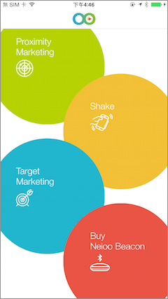

###主要功能：

####位置行銷
此功能主要示範，當使用者搜尋到指定 beacon時，並且使用者的位置符合Neioo Cloud事先所設定的範圍，此時會觸發Neioo Cloud所設定的事件，這裡示範有包含影片、圖片、文字提示。

#####搜尋Neioo app beacon
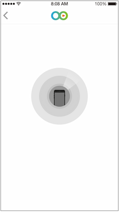

#####進入Neioo space
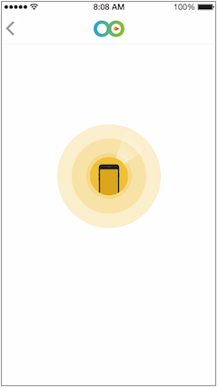

#####觸發事件


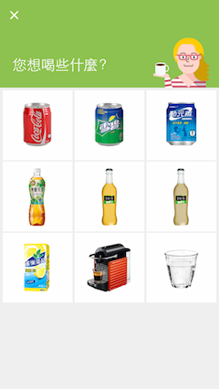
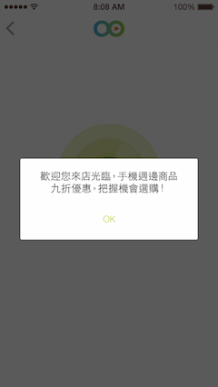

####搖一搖
此功能主要示範，利用 Neioo與使用者做搖一搖互動，當使用者進入符合Neioo Cloud事先所設定的範圍後，此時會顯示"搖一搖"的提示，提示使用者現在搖一搖手機，可以觸發Neioo Cloud所設定的事件，此提示可隨Neioo Cloud設定而改變。

#####進入搖一搖範圍
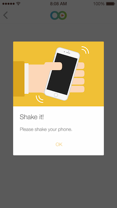


####目標行銷
此功能主要示範，當使用者搜尋到指定 beacon時，並且使用者的位置與使用者資料符合Neioo Cloud事先所設定，此時會觸發Neioo Cloud所設定的事件，這裡示範有包含圖片、影片、網頁HTML、文字提示。

#####輸入使用者資料

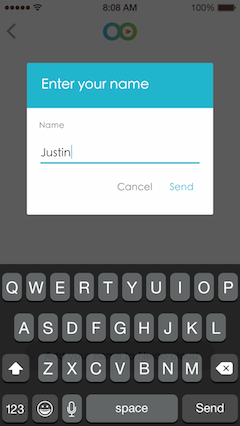

###Neioo Cloud 設定：

####建立Beacon
將您所使用的beacon相關資料輸入，這裏最重要的是beacon serial number請正確輸入(大小寫有差別)，其他資料可從Neioo Officer匯入，Neioo SDK只會認證Neioo Cloud所設定的beacon。
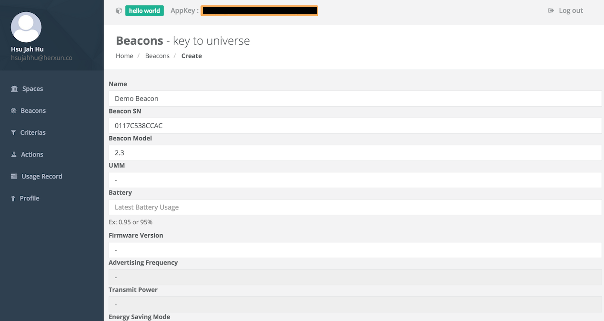

####建立Criteria
設定所需的觸發條件，此示範只有使用到equal的operator。
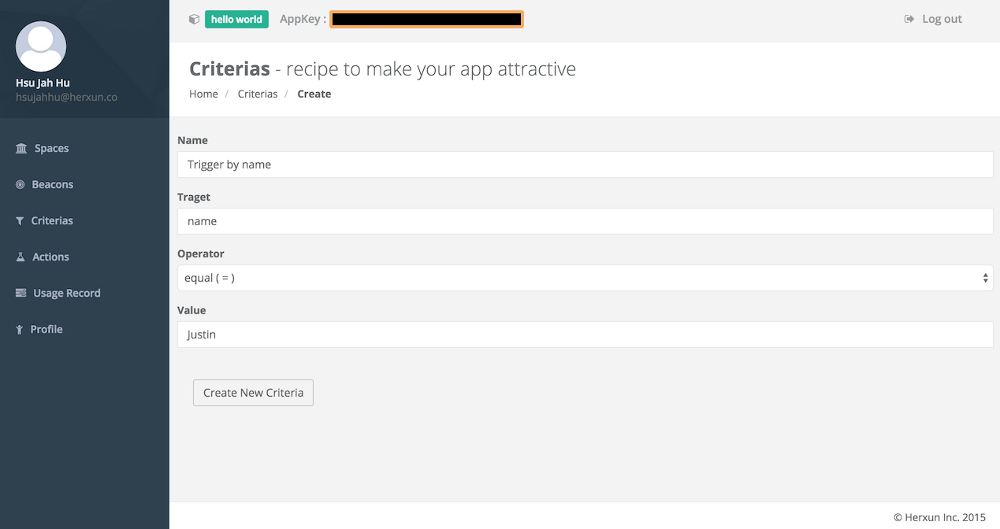

####建立Action
設定觸發的動作，此示範使用到show_image、show_video、show_webview、local_push，這裡針對這四個功能設定做介紹。

#####Acton：show_image
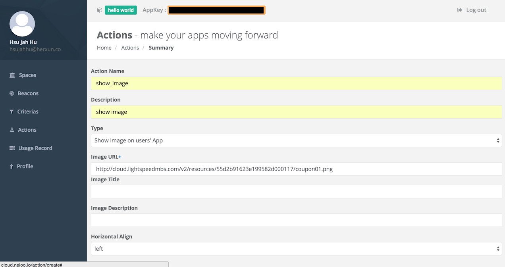

#####Acton：show_video
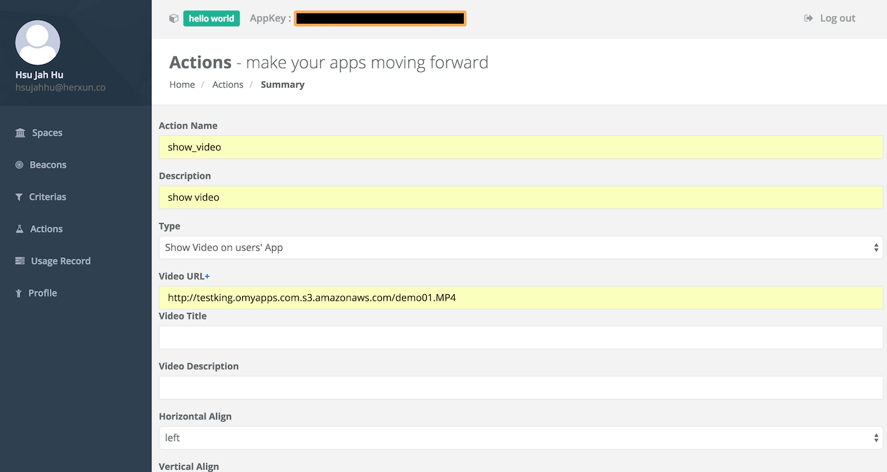


#####Acton：show_webview
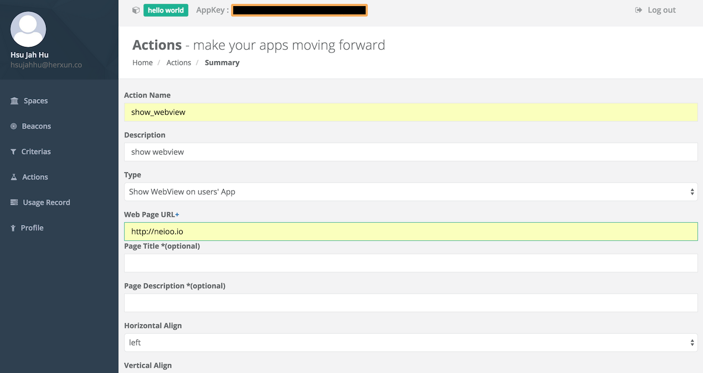

#####Acton：local_push
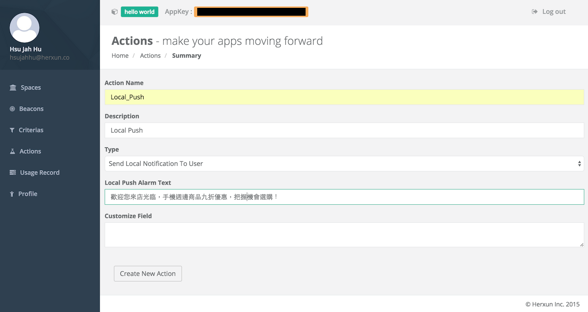

####建立Space
設定Space的名字與描述即可，這些當使用者進入Space後，此資料可透過Neioo SDK擷取下來。
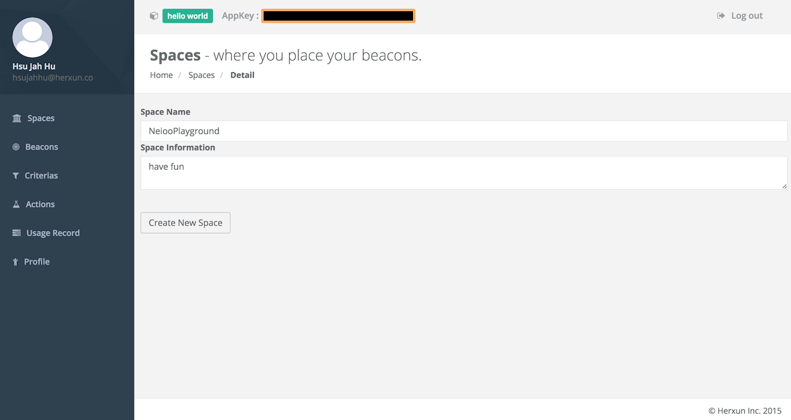

####建立Campaign
這個動作是實作beacon觸發最關鍵的一個步驟，其中在建立時，可以設定觸發的頻率、觸發條件、觸發動作、觸發beacon、觸發事件特殊種類(shake or beacon motion trigger)。
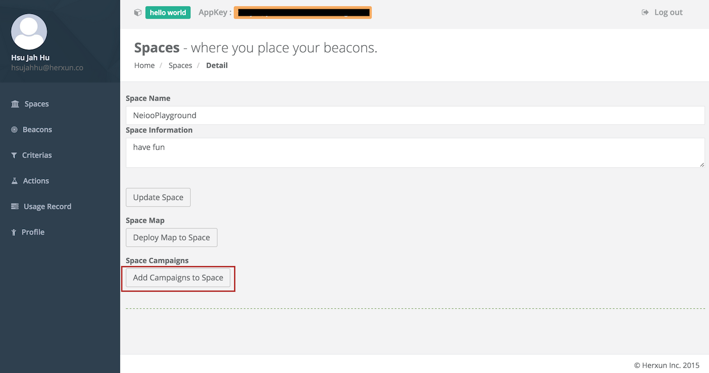
#####建立campaign有幾個重要的步驟：    

- 選beacon來觸發此campaign
- 選擇此campaign所要觸發的action
- 選擇觸發所需要符合的criteria(非必要)

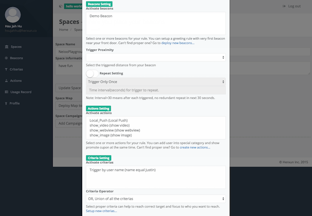

#####觸發特殊事件：搖一搖
在設定campaign時，可以在customize setting設定特殊觸發事件，`shake|`提示為搖一搖事件，後面再帶入提示參數
```
ex.
{"title":"Shake it!","description":"Please shake your phone","image_url":"http://cloud.lightspeedmbs.com/v2/resources/55b5adc029361a7134000534/shake.png"}
```
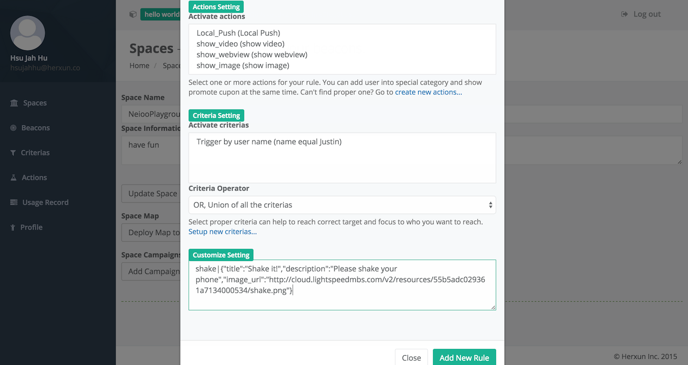

###Project 設定
####iOS
請到`Config.h`將你在Neioo Cloud所產生的`App Key`填入即可
```
#define NEIOO_APP_KEY @"YOUR_APP_KEY"
```

####Android
找到專案的 `res/values/string.xml`，將你在Neioo Cloud所產生的`App Key`填入即可
```
<string name="neioo_appkey">YOUR_APP_KEY</string>
```